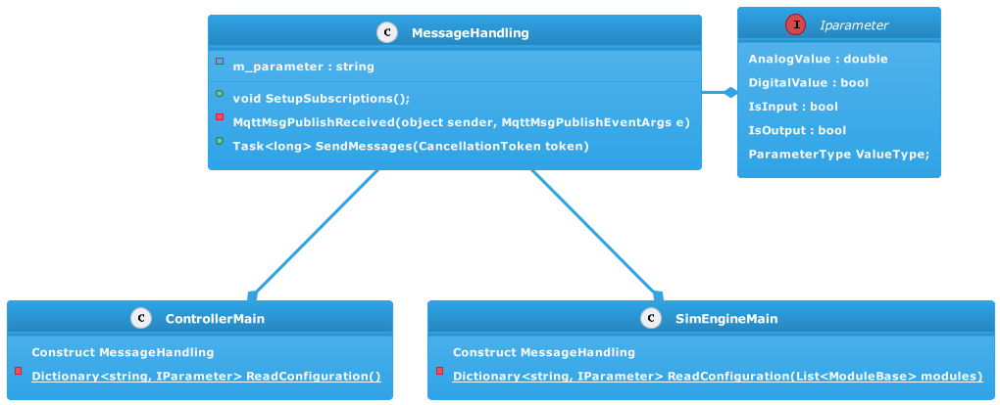
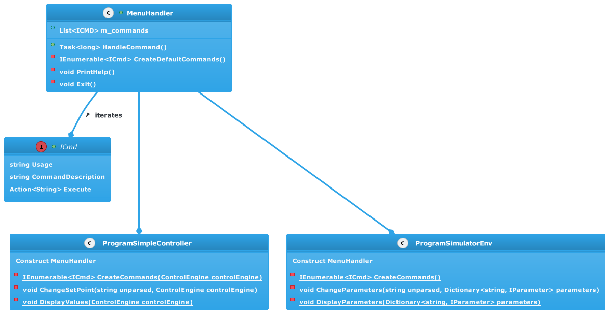

# Common Library
This library contains common functionality for the Controller and the Simulator such as MQTT message handling, console command handling, Parameter database, controller interface  and more.

## Message Handling
The MQTT messages are handled using a common class that handles parametrization and MQTT communication. This common class is then instantiated in both the Simulation and the Controller to update the parameter values in both respectively. 

## Command Handling

Console commands are handled by using an interface called ICmd, a concrete class that implements the interface called Command and a class that handles the input from the console called MenuHandler that executes the commands. 
The command methods are sent along as the Action delegate to the executing MenuHandler. When an input is provided, the MenuHandler iterates through the ICmds and if there is a match, it executes the Action of that command. 

